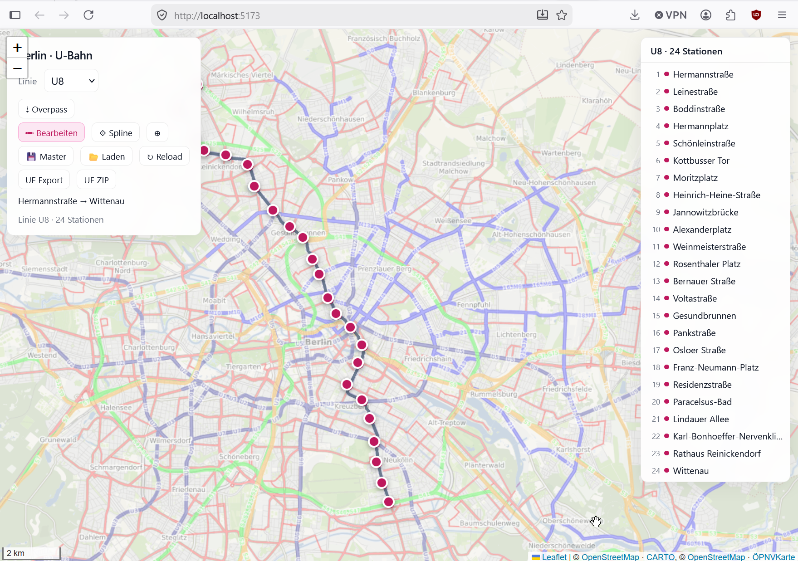
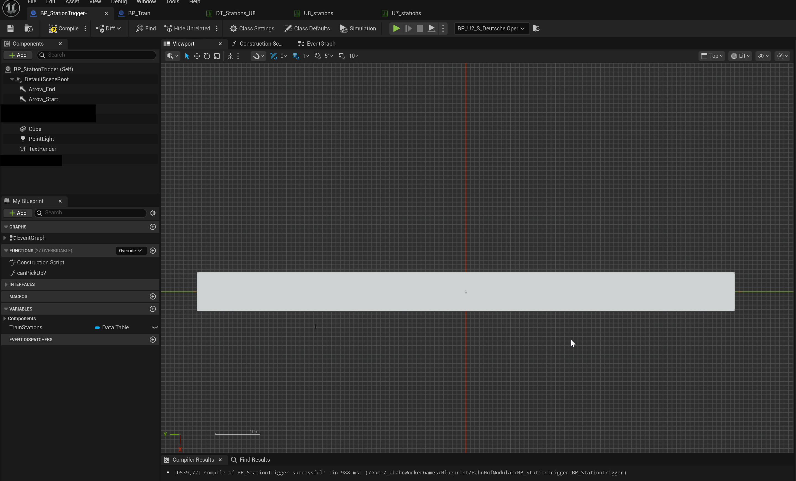

# UEMap Import

Use this folder to import one line into Unreal.

## What is here
- `ue_import_u8_spline_source.py` imports the route source into UE.
- `U7.json`, `U8.json`, `U9.json` are the route source files.
- `generated/` gets the JSON export for DataTables.
- `Tool/` is the web editor.
- `uemap-web-editor.png` is the web editor preview.
- `uemap-station-axis.png` shows the station actor layout.

## How to use
1. Keep only the line you want to import in this folder.
2. Delete the other line JSON files before running the script.
3. Run `ue_import_u8_spline_source.py` inside Unreal Python.
4. The script spawns one `BP_Rail` for the whole line.
5. That spline is the shared base for both travel directions.
6. The script also spawns the station actors and writes the generated JSON files into `generated/`.
7. Station actors need `Arrow_Start` and `Arrow_End` on the local Y axis.
8. The station is aligned by the spline, so the arrows define the station forward direction.

## Web Editor
1. Open a terminal in `Tool/`.
2. Run `npm install` once.
3. Run `npm run dev` to start the editor.
4. Use `npm run build` if you want a production bundle.
5. The editor is the place where you edit the line before exporting it into UE.

## In Unreal
- Import the generated `*_stations.json` into the station DataTable.
- Import the generated `*_sections.json` into the section DataTable.
- Use the rail spline for both directions, do not build a second route.

## Web Editor Preview

## Station Axis

## Notes
- If you move a spline point and the curve breaks, that is a known bug in the current workflow.
- Workaround: move the neighboring point too and re-export.
- If you know the real fix, tell me.
- No fallback data is used. Missing data should fail loudly.
